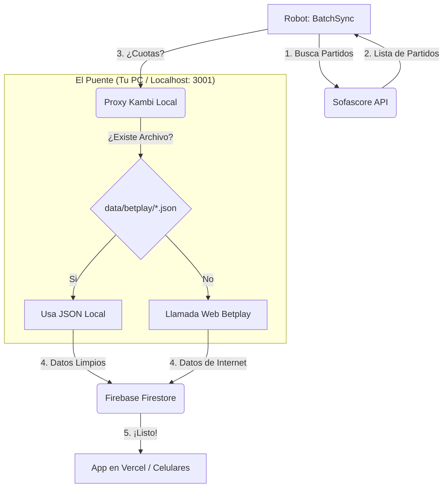

# 🧠 Guía Visual: ¿Cómo funciona la sincronización ahora?

Entiendo que parece enredado, pero el sistema está diseñado para que **tú no tengas que hacer nada técnico**. Aquí te explico el camino que sigue la información:

## 🔄 El Flujo Automático

---

## 🧐 Respuestas a tus dudas:

### 1. ¿Quién hace la petición?
**Es Automático.** 
El robot (BatchSyncService) es el jefe. Él decide cuándo llamar. Tú solo tienes que:
- O esperar al "Cron" (reloj automático).
- O darle al botón de "Sincronizar Todo" en tu panel de administración.

### 2. ¿Cuándo es manual?
**Casi nunca.** 
Solo es manual **si y solo si** ves que Betplay te bloquea (Error 403) y quieres forzar los datos. En ese caso, solo pegas el archivo JSON en la carpeta y **el robot, en su próxima vuelta automática, lo verá solo**.

### 3. El papel de Firebase
Firebase es tu **almacén central**.
- El **Robot** (en tu PC o Render) escribe en Firebase.
- La **App de los usuarios** (en Vercel) lee de Firebase.
- Gracias a esto, si tu PC se apaga, los usuarios siguen viendo los últimos datos guardados en Firebase.

### 4. ¿Por qué el Proxy (Puerto 3001)?
Porque es tu "Disfraz". 
Si el Robot llamara directo a Betplay, lo banearían rápido. El proxy le pone "gafas de sol" (headers) y revisa si tienes un JSON guardado para no tener que salir a internet.

> [!IMPORTANT]
> **Tú no tienes que configurar nada más**. Ya dejé conectado el `web` con el `server.js`. Todo el sistema de "reintentos" y "archivos locales" ocurre en silencio por detrás.
